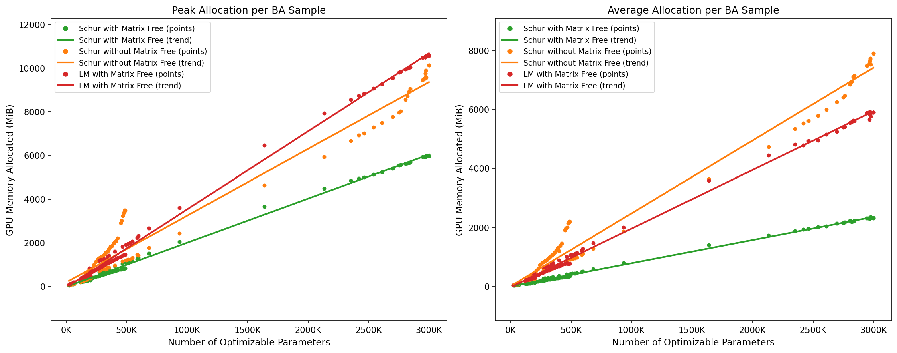

# Improvement by Schur and Matrix-Free

GPU-memory benchmark sweep for `bae`'s Bundle Adjustment optimizers. It runs a
set of [BAL](https://grail.cs.washington.edu/projects/bal/) problems through
several optimizer configurations, records peak and average GPU memory, and plots
memory usage against problem size.

## Output Graph



*Peak (left) and average (right) GPU memory allocation across the three
optimizer configurations, plotted against problem size.*

## Background: Schur complement & matrix-free

### 1) Schur complement

Each Bundle Adjustment step solves a large sparse linear system — the normal
equations `H Δx = g`, with `H = JᵀJ`. The unknowns split into two groups:
**camera** parameters (poses + intrinsics) and **3D point** parameters. Ordering
them that way gives `H` a 2×2 block structure (symbols match `Schur.step`):

```
[ U   W ] [ Δc ]   [ g_c ]
[ Wᵀ  V ] [ Δp ] = [ g_p ]
```

- `U = J0ᵀ J0` — camera block
- `V = J1ᵀ J1` — point block, **block-diagonal**: each 3D point touches only its
  own observations, so `V⁻¹` is cheap to apply
- `W = J0ᵀ J1` — camera–point coupling

Because `V` is trivially invertible, the point unknowns can be eliminated,
leaving a much smaller system in the cameras only — the **Schur complement**
system:

```
S Δc = g_c − W V⁻¹ g_p ,     where   S = U − W V⁻¹ Wᵀ
```

`bae` solves this reduced system for the camera update `Δc` with preconditioned
CG, then **back-substitutes** to recover the points:

```
Δp = V⁻¹ (g_p − Wᵀ Δc)
```


### 2) Matrix-free

The operator `S` can be handled two ways, which is what the `matrix_free_normal`
flag selects. The branch lives in [`bae/optim/optimizer.py`](../bae/optim/optimizer.py)
— inside `Schur.step` (and `LM.step` for the non-Schur path):

- **`False` — normal path** (the *Schur, normal* condition) — the matrices are **materialized**: `W`,
  `Wᵀ`, the product `W V⁻¹ Wᵀ`, and the assembled `S` are built explicitly as
  sparse matrices and handed to the solver.
- **`True` — matrix-free path** (the *Schur, matrix-free* condition) — `S` (and even `W`) is **never
  formed**. CG only needs the result of `S·x` for a vector `x`, so the operator
  is applied on the fly as a chain of sparse matrix–vector products (`J0`, `J1`,
  `V⁻¹`, …) inside `schur_matvec`.

Iterative solvers like CG never inspect the matrix entries — they only multiply
the matrix by a vector — so the matrix-free form computes the **same** step while
**avoiding the memory of storing `W`, `Wᵀ`, and `S`**. That saved memory grows
with problem size, which is exactly what the plots show: the matrix-free
conditions (*Schur, matrix-free* and *LM, matrix-free*) sit well below
*Schur, normal*.

The same flag also applies to the plain `LM` optimizer, where it swaps the
explicitly built `JᵀJ` matrix for the matrix-free `NormalMatVec` operator.

## What it measures

| Metric | Meaning |
| --- | --- |
| Number of parameters | The count of optimizable parameters: 3 per 3D point (xyz position) plus 7 per camera — i.e. 3 × (number of 3D points) + 7 × (number of cameras) |
| Peak GPU memory | The peak allocation in MiB — the max of the background sampler, `torch.cuda.max_memory_allocated`, and the Warp mempool high-water mark |
| Average GPU memory | The mean allocation in MiB over the run, sampled every 5 ms |

GPU memory is the sum of **PyTorch** allocations 
and the **Warp** memory pool captured by a
background `MemorySampler` thread with interval 5ms.

## Conditions

Optimizer | `matrix_free_normal` | Color |
--- | --- | --- |
`Schur` | `True` | green |
`Schur` | `False` | orange |
`LM` | `True` | red |

The optimizer setup (shared by all conditions) is:

- Strategy: `TrustRegion(up=2.0, down=0.5**4)`
- Solver: `PCG(tol=1e-4, maxiter=250)`
- `reject=30`
- Model: `Residual` from [`examples/schur.py`](../examples/schur.py), optimizing
  camera params + 3D points. Intrinsics are included
  (`OPTIMIZE_INTRINSICS = True` → 10 camera params per camera).

This whole setup about the `TrustRegion` / `PCG` / `reject=30` configuration and the
`Residual` model is taken from the reference example
[`examples/schur.py`](../examples/schur.py).

## How it works

The three benchmark conditions all optimize the same reprojection `Residual`
model from [`examples/schur.py`](../examples/schur.py), and trace a path from the
`LM` baseline to `Schur` with matrix-free normal equations — each step lowers GPU
memory (the mechanism behind each is detailed in *Background* above):

1. **`LM` → `Schur`** — instead of solving the full normal equations, `Schur`
   eliminates the block-diagonal point block `V` and only solves the much
   smaller camera-only *reduced* system. Fewer unknowns reach the CG solver and
   the reduced system is better conditioned.
2. **`+ matrix-free`** — the reduced operator `S` is applied through
   matrix–vector products instead of being materialized, so `W`, `Wᵀ`, and `S`
   are never stored. This is where the bulk of the memory saving comes from.

Measured on the largest benchmark problem (`venice/problem-1778`, ≈ 3.0 M
optimizable parameters):

| Condition | Peak | Average |
| --- | --- | --- |
| LM, matrix-free | ~10.3 GiB | ~5.8 GiB |
| Schur, normal | ~9.9 GiB | ~7.7 GiB |
| Schur, matrix-free | **~5.8 GiB** | **~2.3 GiB** |

So **Schur with matrix-free** uses about **43% less peak** memory than the
**LM (matrix-free)** baseline (~4.5 GiB less) and **~60% less average**. Notably,
**Schur with the normal (materialized) path** has the *highest* average of the
three — building `W`/`Wᵀ`/`S` explicitly keeps that memory occupied for the
entire solve — so it is the **matrix-free** half that makes Schur pay off, not
the complement alone. **Schur with matrix-free** also has the flattest
memory-vs-size trend (~2.0 vs ~3.6 MiB per 1 K parameters at peak), so the gap
keeps widening as problems grow.

## Configuration

Knobs near the top of the script:

| Constant | Value | Purpose |
| --- | --- | --- |
| `TARGET_PROBLEMS` | ladybug / trafalgar / dubrovnik / venice list | Which BAL problems to sweep |
| `CONDITIONS` | 3 configs | Optimizer / matrix-free combinations to compare |
| `DEVICE` | `"cuda"` | Compute device |
| `NUM_ITERATIONS` | `20` | LM steps per run |
| `OPTIMIZE_INTRINSICS` | `True` | Include camera intrinsics (10 vs 7 camera params) |
| `MEMORY_SAMPLE_INTERVAL_S` | `0.005` | Background memory sampling interval |

## Requirements

- CUDA-capable GPU (the script asserts a Warp CUDA device is available)
- PyTorch, NumPy, Matplotlib, [Warp](https://github.com/NVIDIA/warp) (`warp-lang`)
- `bae` installed (see the repo [README](../README.md)); BAL problems are
  downloaded/cached on first use via `datapipes.bal_loader.get_problem`.
